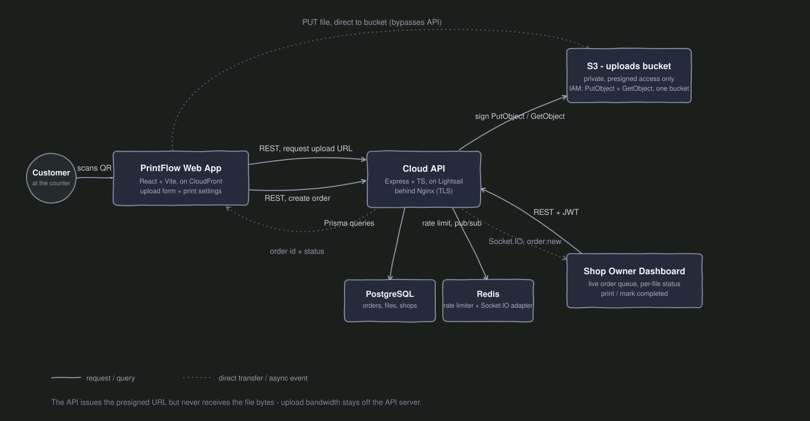

# PrintFlow

**Live app:** [printflow.cc](https://printflow.cc)
**API:** [api.printflow.cc](https://api.printflow.cc)

PrintFlow replaces the WhatsApp-based order intake most small print shops still run today - a customer scans a QR code at the counter, uploads a PDF, picks print settings, and the order appears on the shop owner's dashboard instantly. No manually downloading attachments out of a chat thread, no "how many copies?" back-and-forth.

---

## Demo

- **Try it live:** open [printflow.cc](https://printflow.cc) and use the interactive simulator on the homepage - no signup required.
- **Demo shop owner login:** `owner1@printflow.dev` / `password123`

---

## Why this project

Print shops in India (and equivalent small print counters elsewhere) almost universally run order intake through WhatsApp - a customer sends a PDF, the owner downloads it manually, confirms copies and color or B&W, and the whole exchange is unstructured, repeated per customer, all day. PrintFlow digitizes exactly that workflow: a QR code replaces the phone number, a structured upload form replaces the chat message, and a live dashboard replaces scrolling through WhatsApp looking for the next order.

The goal was to go deep on one real, well-scoped problem rather than build another generic CRUD app - the interesting engineering here is tenant isolation across a multi-shop system, secure direct-to-S3 uploads, real-time order sync that survives reconnects, and a production deployment built from raw infrastructure rather than a PaaS.

---

## Features

- **QR-code ordering** - each shop gets a permanent, auto-generated QR code (and shareable link) pointing at its own upload page; no app download for the customer.
- **Multi-file uploads** - a customer can submit several PDFs in one order, each with its own copy count and color mode (black & white or color).
- **Live order queue** - new orders appear on the shop owner's dashboard the moment they're submitted, over a live socket connection, with reconnection-safe behavior (see below).
- **Per-file print lifecycle** - each file moves independently through `Pending → Printing → Completed`, since a real order often mixes files at different stages.
- **One-click print** - the owner's "Print" button fetches a fresh presigned download URL and opens the file in the browser's native PDF viewer, which handles the actual print dialog.
- **Auto-generated shop slugs** - a shop owner never has to understand or type a URL slug; one is derived from their shop name at signup, with automatic collision handling.
- **Tenant isolation** - a shop can never read or modify another shop's orders or files, enforced structurally at the data-access layer.

---

## Architecture



**Frontend** - React + Vite + TypeScript + Tailwind, built to static files and served from S3 through CloudFront (CDN + a free ACM-managed TLS certificate).

**Backend** - Node.js + Express + TypeScript, containerized with Docker, running on an AWS Lightsail VPS behind Nginx (reverse proxy + TLS termination via Let's Encrypt/Certbot).

**Database** - PostgreSQL via Prisma. Redis backs both the request rate limiter and the Socket.IO pub/sub adapter.

**File storage** - S3. Customers upload files **directly to S3** using a short-lived presigned URL - the API server issues the URL but never receives the file bytes, so upload bandwidth scales independently of the backend.

**CI/CD** - two path-filtered GitHub Actions pipelines. A push touching `backend/**` SSHes into the server, pulls, rebuilds the Docker image, and runs any pending Prisma migrations. A push touching `frontend/**` builds the app, syncs the output to S3, and invalidates the CloudFront cache. A frontend-only change never redeploys the backend, and vice versa.


       

---

## Key engineering decisions

### Tenant isolation as a structural guarantee, not a convention

Every query that touches order or file data goes through a `scopedOrders(shopId)` factory (`backend/src/lib/scopedOrders.ts`) instead of calling Prisma directly inside route handlers. Every method it exposes takes the shop's ID and filters by it, so there's no code path where a query can run without a shop-scope filter - the factory simply doesn't expose one that skips it. When a record is fetched by ID, ownership is checked explicitly (`if (record.shopId !== shopId) return null`) and treated identically to "doesn't exist," so a shop can never learn that a record exists but belongs to someone else - that itself would be an information leak.

### Direct-to-S3 uploads via presigned URLs

The upload flow: browser asks the API for a presigned S3 URL, the browser PUTs the file straight to S3, then the browser tells the API "here's the file's key, create the order." The API generates a 5-minute signed URL but never touches the file itself. This keeps upload bandwidth entirely off the API server and means a large PDF can't tie up a request thread. S3's own CORS policy (not the API's) governs which origins are allowed to PUT/GET objects directly, since that traffic never passes through Express at all.

### Reconnection-safe real-time updates

The dashboard fetches its order list over plain HTTP on mount - that's the source of truth. Socket.IO sits on top purely as a live-update channel for orders arriving after the initial load. If the socket drops and reconnects, the dashboard never silently misses an order - a refresh always gets the correct current state via HTTP, and the socket resumes pushing new arrivals from there. The Socket.IO server is also wired with a Redis pub/sub adapter, so the same design works unchanged if the API were ever scaled to multiple instances.

### Multi-file orders, per-file lifecycle

An `Order` is a lightweight grouping container; each file inside it (`OrderFile`) carries its own status (`PENDING` to `PRINTING` to `COMPLETED`), copy count, and color mode. In practice a customer often uploads several documents that need different settings, and a shop owner works through them one file at a time - the dashboard's status tabs and counts are computed at the file level for that reason.

### Rate limiting and IAM scoping

Order creation and uploads are rate-limited per IP via `express-rate-limit`, backed by Redis rather than in-memory counters, so limits survive a server restart and would work correctly across multiple instances. Two separate, narrowly-scoped IAM users are used in production rather than one shared set of credentials: one for the backend (`s3:PutObject` / `s3:GetObject` on the uploads bucket's objects only), and a second, independent one for the GitHub Actions frontend pipeline (`s3:PutObject` / `s3:DeleteObject` / `s3:ListBucket` on the frontend bucket, plus `cloudfront:CreateInvalidation`) - neither can do anything outside what it specifically needs.

### CORS is enforced in two independent places

Cross-origin requests to the API (login, orders, etc.) are validated in Express against an explicit allow-list of real origins, with `localhost` automatically included only when `NODE_ENV !== "production"` - so local development never needs manual toggling, and the production server never accidentally accepts requests from an untrusted origin. Direct browser-to-S3 uploads are a completely separate request path that never touches Express, so S3's own bucket-level CORS configuration is what governs those - both had to be configured correctly, independently, for uploads to work end-to-end.

---

## Project structure

```
printflow/
├── backend/
│   ├── src/
│   │   ├── controllers/     # route handlers
│   │   ├── routes/          # shop (public), auth, me (owner-authenticated)
│   │   ├── services/        # auth, S3 presigning
│   │   ├── middleware/      # JWT auth, rate limiting
│   │   └── lib/              # prisma client, scopedOrders, socket setup, redis
│   ├── prisma/                # schema + migrations
│   └── Dockerfile             # multi-stage build
├── frontend/
│   ├── src/
│   │   ├── pages/             # Home, Login, Signup, Dashboard, Upload, Shop QR
│   │   ├── components/        # shared UI + homepage-specific components
│   │   ├── store/              # Zustand auth store
│   │   └── lib/                # axios instance
├── docs/
│   └── architecture-diagram.svg
├── docker-compose.yml          # local dev (Postgres + Redis)
├── docker-compose.prod.yml     # production (Postgres + Redis + API)
└── .github/workflows/          # backend + frontend deploy pipelines
```

---

## API reference

| Method | Route | Auth | Description |
|---|---|---|---|
| `GET` | `/health` | none | health check |
| `POST` | `/auth/signup` | none | create a shop + owner account, returns a JWT |
| `POST` | `/auth/login` | none | authenticate, returns a JWT |
| `GET` | `/shops/:slug` | none | public shop info, used by the customer upload page |
| `POST` | `/shops/:slug/upload-url` | none, rate-limited | returns a presigned S3 PUT URL for a single file |
| `POST` | `/shops/:slug/orders` | none, rate-limited | creates an order from one or more already-uploaded files |
| `GET` | `/me/shop` | JWT | the logged-in owner's own shop |
| `GET` | `/me/orders` | JWT | all orders for the logged-in owner's shop, tenant-scoped |
| `GET` | `/me/orders/:orderId` | JWT | a single order, tenant-scoped |
| `PATCH` | `/me/files/:fileId/status` | JWT | update a single file's status (`PRINTING` / `COMPLETED`), tenant-scoped |
| `GET` | `/me/files/:fileId/download-url` | JWT | returns a presigned S3 GET URL for one file, tenant-scoped |

All `/me/*` routes go through `scopedOrders(shopId)` — a request is rejected as a `404`, not a `403`, if the resource exists but belongs to a different shop, so ownership can never be inferred from the response.

---

## Running locally

**Prerequisites:** Node 20+, Docker, an AWS account with an S3 bucket for uploads.

```bash
git clone https://github.com/SagarLonkar-18/Printflow.git
cd Printflow

# Postgres + Redis
docker compose up -d

# Backend
cd backend
cp .env.example .env    # fill in DATABASE_URL, JWT_SECRET, AWS credentials, etc.
npm install
npx prisma migrate dev
npm run dev               # http://localhost:4000

# Frontend (new terminal)
cd frontend
cp .env.example .env      # VITE_API_URL=http://localhost:4000
npm install
npm run dev                # http://localhost:5173
```

For local uploads to work, your S3 bucket's CORS configuration needs `http://localhost:5173` in its allowed origins - see step 4 in Deployment below for the exact policy.

---

## Deployment

This section documents the exact production setup end to end - useful if you're standing up your own copy, or just want to see how the pieces actually fit together.

### Overview

- **Backend** runs in Docker on a Lightsail VPS, behind Nginx for TLS termination.
- **Frontend** is a static build synced to S3, served through CloudFront.
- **Both** deploy automatically via GitHub Actions on every push to `main`, scoped by which part of the repo changed.

### 1. Provision the server

- Create an AWS Lightsail instance - Ubuntu 24.04 LTS, minimum 1 GB RAM.
- In the instance's networking settings, open ports **22** (SSH), **80** (HTTP - needed for Certbot renewal and the HTTP→HTTPS redirect), and **443** (HTTPS).
- On a 1 GB instance, add a swap file before doing any Docker builds - the one-time build step (`npm install`, `tsc`, `prisma generate`) can spike memory past what 1 GB alone provides:

```bash
sudo fallocate -l 1G /swapfile
sudo chmod 600 /swapfile
sudo mkswap /swapfile
sudo swapon /swapfile
echo '/swapfile none swap sw 0 0' | sudo tee -a /etc/fstab
```

### 2. Install Docker

Ubuntu's default repos ship an outdated Docker build - install from Docker's own official repository instead:

```bash
sudo apt remove -y docker.io
sudo apt install -y ca-certificates curl gnupg
sudo install -m 0755 -d /etc/apt/keyrings
curl -fsSL https://download.docker.com/linux/ubuntu/gpg | sudo gpg --dearmor -o /etc/apt/keyrings/docker.gpg
sudo chmod a+r /etc/apt/keyrings/docker.gpg

echo \
  "deb [arch=$(dpkg --print-architecture) signed-by=/etc/apt/keyrings/docker.gpg] https://download.docker.com/linux/ubuntu \
  $(. /etc/os-release && echo "$VERSION_CODENAME") stable" | \
  sudo tee /etc/apt/sources.list.d/docker.list > /dev/null

sudo apt update
sudo apt install -y docker-ce docker-ce-cli containerd.io docker-buildx-plugin docker-compose-plugin
sudo usermod -aG docker $USER
```

Log out and back in for the group change to take effect, then confirm with `docker --version` and `docker compose version`.

### 3. Clone the repo and configure environment

```bash
git clone https://github.com/SagarLonkar-18/Printflow.git
cd Printflow
```

Create the root `.env` with Postgres credentials for `docker-compose.prod.yml`:

```
POSTGRES_USER=printflow
POSTGRES_PASSWORD=<strong-random-password>
POSTGRES_DB=printflow
```

Create `backend/.env` with production values:

```
NODE_ENV=production
PORT=4000
CLIENT_URL=https://yourdomain.com

DATABASE_URL="postgresql://printflow:<same-password>@postgres:5432/printflow?schema=public"
REDIS_URL="redis://redis:6379"

JWT_SECRET="<a fresh, unique secret - do not reuse a dev value>"
JWT_EXPIRES_IN="7d"

AWS_REGION="ap-south-1"
AWS_ACCESS_KEY_ID="<backend IAM user's access key>"
AWS_SECRET_ACCESS_KEY="<backend IAM user's secret key>"
S3_BUCKET_NAME="<your uploads bucket>"
```

`DATABASE_URL` and `REDIS_URL` point at `postgres` and `redis` as hostnames - that's Docker Compose's internal service-name resolution, not `localhost`. `NODE_ENV=production` matters beyond just labeling: the backend's CORS allow-list only includes `localhost` when this is *not* set to `production`, so it must be set correctly here for the API to reject untrusted origins in production.

### 4. Create the S3 buckets and IAM users

Two separate buckets, two separate IAM users - each scoped to exactly what it needs.

**Uploads bucket** (private, accessed only via presigned URLs):

- Create a bucket (e.g. `printflow-uploads-demo`), keep "block all public access" **on**.
- Add a CORS configuration so browsers can PUT/GET directly:

```json
[
  {
    "AllowedOrigins": ["https://yourdomain.com", "https://www.yourdomain.com", "http://localhost:5173"],
    "AllowedMethods": ["PUT", "GET"],
    "AllowedHeaders": ["*"]
  }
]
```

- Create an IAM user (e.g. `printflow-backend-demo`) with an inline policy scoped to just this bucket:

```json
{
  "Version": "2012-10-17",
  "Statement": [
    {
      "Effect": "Allow",
      "Action": ["s3:PutObject", "s3:GetObject"],
      "Resource": "arn:aws:s3:::printflow-uploads-demo/*"
    }
  ]
}
```

Generate an access key for this user and use it as `AWS_ACCESS_KEY_ID` / `AWS_SECRET_ACCESS_KEY` in `backend/.env`.

**Frontend bucket** (public, static website hosting):

- Create a second bucket (e.g. `printflow-frontend-demo`), **disable** "block all public access."
- Enable static website hosting, with `index.html` as both the index and error document - the error-document fallback is what lets React Router handle client-side routes correctly.
- Attach a public-read bucket policy:

```json
{
  "Version": "2012-10-17",
  "Statement": [
    {
      "Sid": "PublicReadGetObject",
      "Effect": "Allow",
      "Principal": "*",
      "Action": "s3:GetObject",
      "Resource": "arn:aws:s3:::printflow-frontend-demo/*"
    }
  ]
}
```

A separate IAM user for this bucket is created in step 7, since it's only used by the CI/CD pipeline, not the running server.

### 5. Build and run the backend

```bash
docker compose -f docker-compose.prod.yml up -d --build
```

This builds the API image with a multi-stage Dockerfile - install and compile happen in a `builder` stage, and only the compiled output plus production `node_modules` get copied into the final runtime image - then starts Postgres, Redis, and the API together on an internal Docker network. Postgres and Redis are not exposed to the host; only the API's port is, and even that is closed off publicly once Nginx sits in front of it.

Apply the database schema:

```bash
docker compose -f docker-compose.prod.yml exec api npx prisma migrate deploy --schema=prisma/schema.prisma
```

### 6. Nginx reverse proxy and TLS

Install Nginx and Certbot:

```bash
sudo apt install -y nginx certbot python3-certbot-nginx
```

Create `/etc/nginx/sites-available/api.yourdomain.com`:

```nginx
server {
    listen 80;
    server_name api.yourdomain.com;

    location / {
        proxy_pass http://localhost:4000;
        proxy_http_version 1.1;

        proxy_set_header Upgrade $http_upgrade;
        proxy_set_header Connection "upgrade";

        proxy_set_header Host $host;
        proxy_set_header X-Real-IP $remote_addr;
        proxy_set_header X-Forwarded-For $proxy_add_x_forwarded_for;
        proxy_set_header X-Forwarded-Proto $scheme;
    }
}
```

The `Upgrade`/`Connection` headers are required for Socket.IO's WebSocket handshake to pass through the proxy correctly.

```bash
sudo ln -s /etc/nginx/sites-available/api.yourdomain.com /etc/nginx/sites-enabled/
sudo nginx -t
sudo systemctl reload nginx
```

Point an A record for `api.yourdomain.com` at the server's IP (see DNS below), wait for it to resolve, then issue a real certificate:

```bash
sudo certbot --nginx -d api.yourdomain.com
```

Certbot rewrites the Nginx config in place to add a `listen 443 ssl` block, wires in the certificate, sets up an HTTP→HTTPS redirect, and configures automatic renewal - choose "redirect HTTP to HTTPS" when prompted.

### 7. Frontend: S3, CloudFront, and ACM

- Build the frontend with the real API URL baked in (`VITE_API_URL=https://api.yourdomain.com`) - Vite bakes environment variables in at build time, so this must be set correctly before building, not after.
- Upload the **contents** of `frontend/dist/` to the frontend bucket's root - not the `dist/` folder itself, or `index.html` won't be found at the bucket root.
- Create a CloudFront distribution using the S3 bucket's **website endpoint** (not the plain bucket endpoint) as the origin - the website endpoint is what supports the SPA fallback behavior React Router needs.
- Request a public TLS certificate in **AWS Certificate Manager**, in the **`us-east-1`** region specifically - CloudFront requires this regardless of where your other resources live - covering your domain and its wildcard (`yourdomain.com` and `*.yourdomain.com`). Validate it via the DNS CNAME record ACM provides.
- Once issued, attach the domain and certificate to the CloudFront distribution under its settings, then point your domain's DNS at CloudFront's distribution domain.
- Create an IAM user for the frontend deploy pipeline (e.g. `printflow-github-actions-demo`) with an inline policy:

```json
{
  "Version": "2012-10-17",
  "Statement": [
    {
      "Effect": "Allow",
      "Action": ["s3:PutObject", "s3:DeleteObject", "s3:ListBucket"],
      "Resource": ["arn:aws:s3:::printflow-frontend-demo", "arn:aws:s3:::printflow-frontend-demo/*"]
    },
    {
      "Effect": "Allow",
      "Action": ["cloudfront:CreateInvalidation"],
      "Resource": "*"
    }
  ]
}
```

### 8. DNS (Hostinger, or any provider)

- `api.yourdomain.com` - **A** record, pointing at the Lightsail instance's public IP.
- `yourdomain.com` (root/apex) - most registrars don't allow a plain CNAME at the zone apex; use their **ALIAS** or **ANAME** record type (Hostinger auto-converts a root CNAME attempt into one), pointing at CloudFront's distribution domain. If a leftover `A` record already exists at the root, it must be deleted first - a root A record and a root ALIAS/CNAME can't coexist.
- `www.yourdomain.com` - **CNAME**, pointing at CloudFront's distribution domain directly.
- The ACM validation **CNAME** record (from step 7) needs to stay in place permanently, not just during initial issuance - it's re-checked on every certificate renewal.

### 9. CI/CD

Generate a dedicated SSH key pair for GitHub Actions to use - don't reuse a personal key:

```bash
ssh-keygen -t ed25519 -C "github-actions-deploy" -f ~/.ssh/printflow_deploy_key
```

Leave the passphrase empty (press Enter twice) - GitHub Actions can't supply one interactively.

Add the **public** half to the server, so it's trusted for SSH login, without removing any existing key:

```bash
ssh -i ~/path/to/your/existing/key ubuntu@your-server-ip
echo "<contents of printflow_deploy_key.pub>" >> ~/.ssh/authorized_keys
```

In the GitHub repo, add these under **Settings → Secrets and variables → Actions**:

| Secret | Value |
|---|---|
| `SSH_HOST` | the server's public IP |
| `SSH_USER` | `ubuntu` |
| `SSH_PRIVATE_KEY` | full contents of the **private** key file (`printflow_deploy_key`, not `.pub`) |
| `AWS_ACCESS_KEY_ID` | the `printflow-github-actions-demo` IAM user's access key |
| `AWS_SECRET_ACCESS_KEY` | that user's secret key |
| `CLOUDFRONT_DISTRIBUTION_ID` | found on the distribution's overview page in the CloudFront console |

`.github/workflows/deploy-backend.yml` - triggers only on `backend/**` or `docker-compose.prod.yml` changes:

```yaml
name: Deploy Backend
on:
  push:
    branches: [main]
    paths: ["backend/**", "docker-compose.prod.yml"]
jobs:
  deploy:
    runs-on: ubuntu-latest
    steps:
      - uses: appleboy/ssh-action@v1.0.3
        with:
          host: ${{ secrets.SSH_HOST }}
          username: ${{ secrets.SSH_USER }}
          key: ${{ secrets.SSH_PRIVATE_KEY }}
          script: |
            cd ~/Printflow
            git pull origin main
            docker compose -f docker-compose.prod.yml up -d --build api
            docker compose -f docker-compose.prod.yml exec -T api npx prisma migrate deploy --schema=prisma/schema.prisma
```

`.github/workflows/deploy-frontend.yml` - triggers only on `frontend/**` changes:

```yaml
name: Deploy Frontend
on:
  push:
    branches: [main]
    paths: ["frontend/**"]
jobs:
  deploy:
    runs-on: ubuntu-latest
    steps:
      - uses: actions/checkout@v4
      - uses: actions/setup-node@v4
        with: { node-version: 20 }
      - run: npm install
        working-directory: frontend
      - run: npm run build
        working-directory: frontend
        env:
          VITE_API_URL: https://api.yourdomain.com
      - uses: aws-actions/configure-aws-credentials@v4
        with:
          aws-access-key-id: ${{ secrets.AWS_ACCESS_KEY_ID }}
          aws-secret-access-key: ${{ secrets.AWS_SECRET_ACCESS_KEY }}
          aws-region: ap-south-1
      - run: aws s3 sync frontend/dist s3://printflow-frontend-demo --delete
      - run: aws cloudfront create-invalidation --distribution-id ${{ secrets.CLOUDFRONT_DISTRIBUTION_ID }} --paths "/*"
```

From this point on, pushing backend code SSHes in, pulls, rebuilds, and migrates automatically. Pushing frontend code builds, syncs to S3, and busts the CDN cache automatically. Each pipeline only runs when its part of the repo actually changed, and the folder name on the server (`~/Printflow`) must match exactly, including case - Linux filesystems are case-sensitive.

### 10. Final checks

- Confirm `https://api.yourdomain.com/health` returns `{"status":"ok"}`.
- Confirm `https://yourdomain.com` loads the frontend, and that signup, login, and file upload all work against the real production domain - not just against S3's raw website endpoint, since CORS is origin-specific and the raw endpoint is a different origin than the final domain.
- Remove any temporary firewall rule opened for direct testing against port 4000 once Nginx and TLS are confirmed working - production traffic should only ever reach the API through Nginx on 443.

---

## Author

Built by Sagar Lonkar, [GitHub](https://github.com/SagarLonkar-18)
